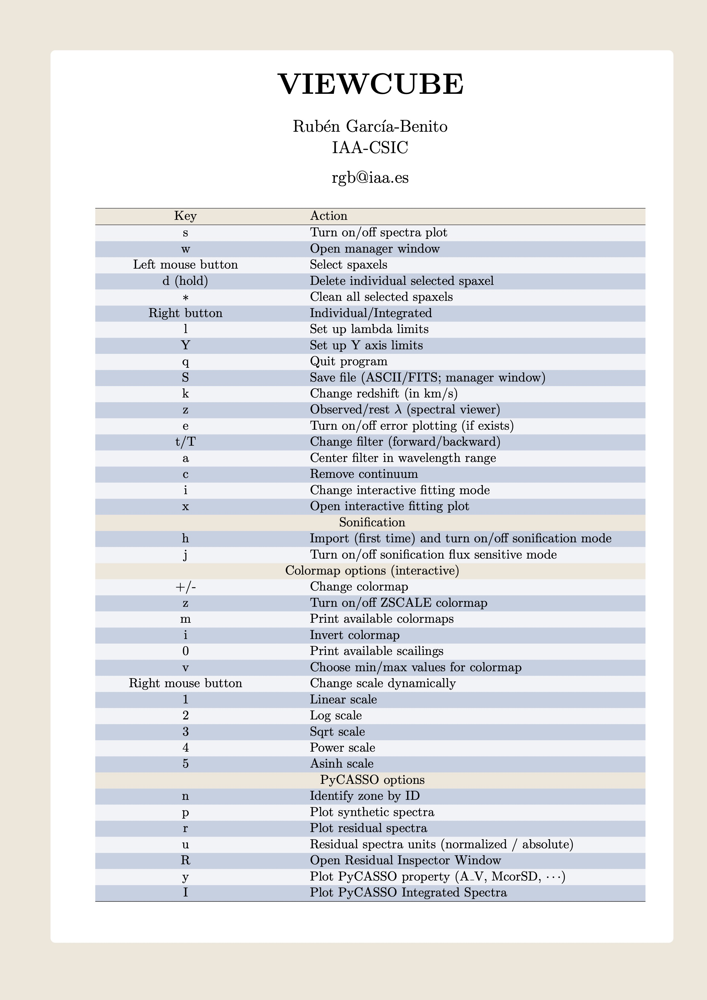

.. _cheatsheet:

***********
Cheat Sheet
***********

+--------------------+-------------------------------------------------------+
| Key                | Action                                                |
+====================+=======================================================+
| s                  | Turn on/off spectra plot                              |
+--------------------+-------------------------------------------------------+
| w                  | Open manager window                                   |
+--------------------+-------------------------------------------------------+
| Left mouse button  | Select spaxels                                        |
+--------------------+-------------------------------------------------------+
| d (hold)           | Delete individual selected spaxel                     |
+--------------------+-------------------------------------------------------+
| `*` (asterisk)     | Clean all selected spaxels                            |
+--------------------+-------------------------------------------------------+
| Right button       | Individual/Integrated                                 |
+--------------------+-------------------------------------------------------+
| l                  | Set up lambda limits                                  |
+--------------------+-------------------------------------------------------+
| Y                  | Set up Y axis limits                                  |
+--------------------+-------------------------------------------------------+
| q                  | Quit program                                          |
+--------------------+-------------------------------------------------------+
| S                  | Save file (ASCII/FITS; manager window)                |
+--------------------+-------------------------------------------------------+
| k                  | Change redshift (in km/s)                             |
+--------------------+-------------------------------------------------------+
| z                  | Observed/rest $\lambda$ (spectral viewer)             |
+--------------------+-------------------------------------------------------+
| e                  | Turn on/off error plotting (if exists)                |
+--------------------+-------------------------------------------------------+
| t/T                | Change filter (forward/backward)                      |
+--------------------+-------------------------------------------------------+
| a                  | Center filter in wavelength range                     |
+--------------------+-------------------------------------------------------+
| c                  | Remove continuum                                      |
+--------------------+-------------------------------------------------------+
| i                  | Change interactive fitting mode                       |
+--------------------+-------------------------------------------------------+
| x                  | Open interactive fitting plot                         |
+--------------------+-------------------------------------------------------+
|                     **Sonification**                                       |
+--------------------+-------------------------------------------------------+
| h                  | Import (first time) and turn on/off sonification mode |
+--------------------+-------------------------------------------------------+
| j                  | Turn on/off sonification flux sensitive mode          |
+--------------------+-------------------------------------------------------+
|                   **Colormap options**                                     |
+--------------------+-------------------------------------------------------+
| +/-                | Change colormap                                       |
+--------------------+-------------------------------------------------------+
| z                  | Turn on/off ZSCALE colormap                           |
+--------------------+-------------------------------------------------------+
| m                  | Print available colormaps                             |
+--------------------+-------------------------------------------------------+
| i                  | Invert colormap                                       |
+--------------------+-------------------------------------------------------+
| 0                  | Print available scailings                             |
+--------------------+-------------------------------------------------------+
| v                  | Choose min/max values for colormap                    |
+--------------------+-------------------------------------------------------+
| Right mouse button | Change scale dynamically  (hold button)               |
+--------------------+-------------------------------------------------------+
| 1                  | Linear scale                                          |
+--------------------+-------------------------------------------------------+
| 2                  | Log scale                                             |
+--------------------+-------------------------------------------------------+
| 3                  | Sqrt scale                                            |
+--------------------+-------------------------------------------------------+
| 4                  | Power scale                                           |
+--------------------+-------------------------------------------------------+
| 5                  | Asinh scale                                           |
+--------------------+-------------------------------------------------------+
|                   **PyCASSO options**                                      |
+--------------------+-------------------------------------------------------+
| n                  | Identify zone by ID                                   |
+--------------------+-------------------------------------------------------+
| p                  | Plot synthetic spectra                                |
+--------------------+-------------------------------------------------------+
| r                  | Plot residual spectra                                 |
+--------------------+-------------------------------------------------------+
| u                  | Residual spectra units (normalized / absolute)        |
+--------------------+-------------------------------------------------------+
| R                  | Open Residual Inspector Window                        |
+--------------------+-------------------------------------------------------+
| y                  | Plot PyCASSO property (A\_V, McorSD, $\cdots$)        |
+--------------------+-------------------------------------------------------+
| I                  | Plot PyCASSO Integrated Spectra                       |
+--------------------+-------------------------------------------------------+

   ViewCube Cheat Sheet

